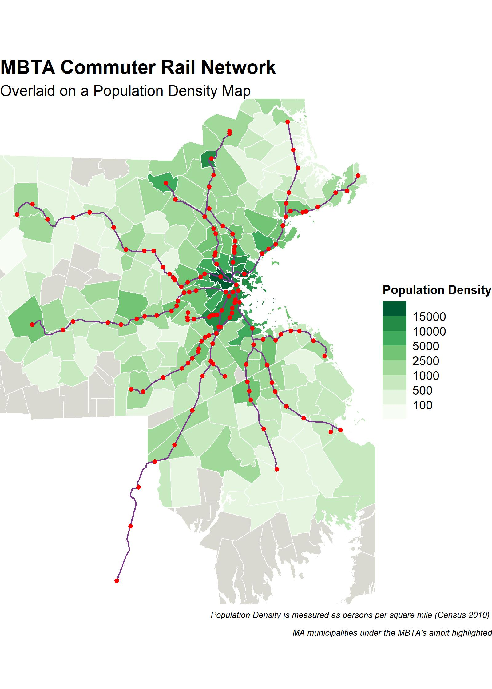

# Mapping in R

Here, I give a very brief overview of the basic components in mapping in R using the ```{sf}``` and ```{ggplot}``` packages.

The code will generate the following map:



Please download the entire zipped file with the project directory, shapefiles, and r code to run it.

Please make as many edits, substitutions, changes to the code as possible to explore the multiple ways in which you can map spatial data in R.

Have fun!
